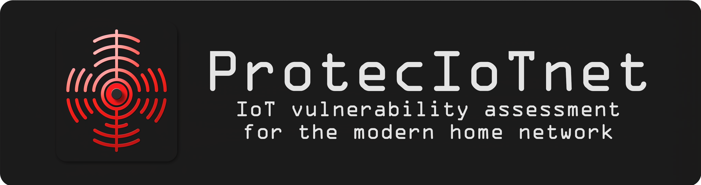

<div align="center">
  <a href="https://github.com/arantarion/proteciotnet_public">
    
  </a>
</div>

<br>
<hr>

<div align="center">
  <h1>ProtecIoTnet</h1>

  <strong>A web based application for identification and vulnerability scanning of smart home IoT devices</strong>
</div>

<div align="center">
<br />

[](https://gitlab.com/hweckermann/proteciotnet/issues?q=is%3Aissue+is%3Aopen+label%3A%22help+wanted%22) 
[](https://gitlab.com/hweckermann)

</div>

---

## About

ProtecIoTnet is a lightweight, easy to use IoT security assessment tool, designed for Smart-Home devices and mainstream wearables. The project is designed to run continuously on a Raspberry Pi4 or similar single-board computers, although it could also be launched on most debian-based systems. Currently supported protocols are Wi-Fi, ZigBee and Bluetooth Low Energy (BLE).

User interaction is handled through a Django Web-Server for the most part. There you can find an overview of all scans, detailed breakdowns of each scan and some actions to further generate information about possible vulnerabilities of you devices (e.g. get CVE entries for each device, try to bruteforce logins for multiple protocols etc.). Furthermore, the Raspberry Pi 4 can be equipped with a cheap 1-77 inch TFT LCD SPI screen to get information about currently running scans without having to be obtrusive in the web interface. Finally, I added a cheap 5 port network switch and some extensions to bring it all together and allow the system to be expanded with further services provided by other devices via the network (e.g. docker container for local CVE search).

ProtecIoTnet was developed for my master's thesis at the FernUniversität in Hagen in collaboration with SySS GmbH in Tübingen who allowed me to create this work and use their resources. I would like to especially thank my supervisors for all their insights and help (also anyone in the hardware team for helping with all my soldering requests).


## Getting Started

### Prerequisites

- Raspberry Pi 4b (or a similar single-board computer) with sufficient memory and processing power
- (You can run ProtecIoTnet on most modern debian based systems)
- Raspbian or another compatible operating system installed on the Raspberry Pi
- Internet connection to update dependencies
- RaspBee II
- Sniffle compatible board see [Sniffle](https://github.com/nccgroup/Sniffle)
- CC 2531 ZigBee USB Dongle
- CC Debugger for flashing

### Quickstart

```bash
# Clone this repository
$ git clone https://github.com/arantarion/proteciotnet_public

# Go into the repository
$ cd proteciotnet_public

# Run installer
$ sudo ./install_proteciotnet.sh

# Change paths in 'proteciotnet.config'

# Run the app
$ sudo ./run_proteciotnet.sh
```

The application will now start on the local server. If the browser doesn't open automatically , please open a web browser and navigate to http://localhost:8000 to access the application.


## Authors & contributors

The original setup of this repository is by [Henry Weckermann](https://github.com/arantarion).


## Security

ProtecIoTnet is a proof of concept. Please do not expose it to the internet as it does not employ any hardening techniques.
ProtecIoTnet is provided **"as is"** without any **warranty**. Use at your own risk.


## License

This project is licensed under the **MIT license**.

See [LICENSE](LICENSE) for more information.

## Acknowledgements

I would like to thank the SySS GmbH for supporting my masters thesis and in turn also this project.
